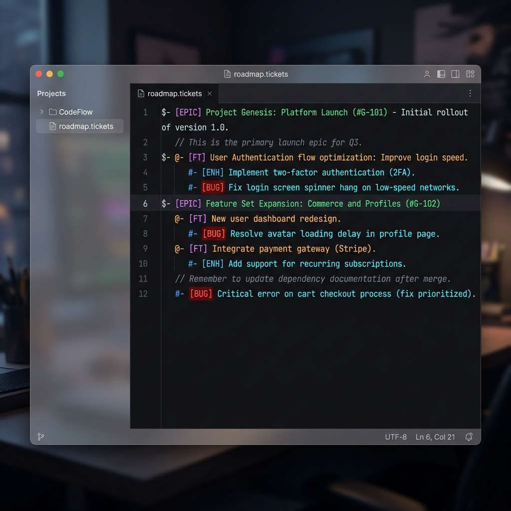
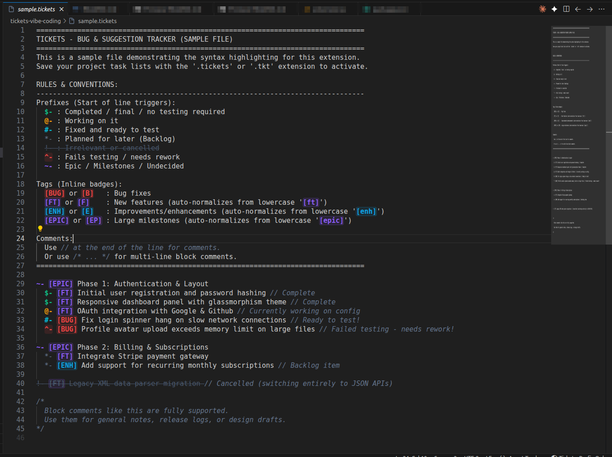
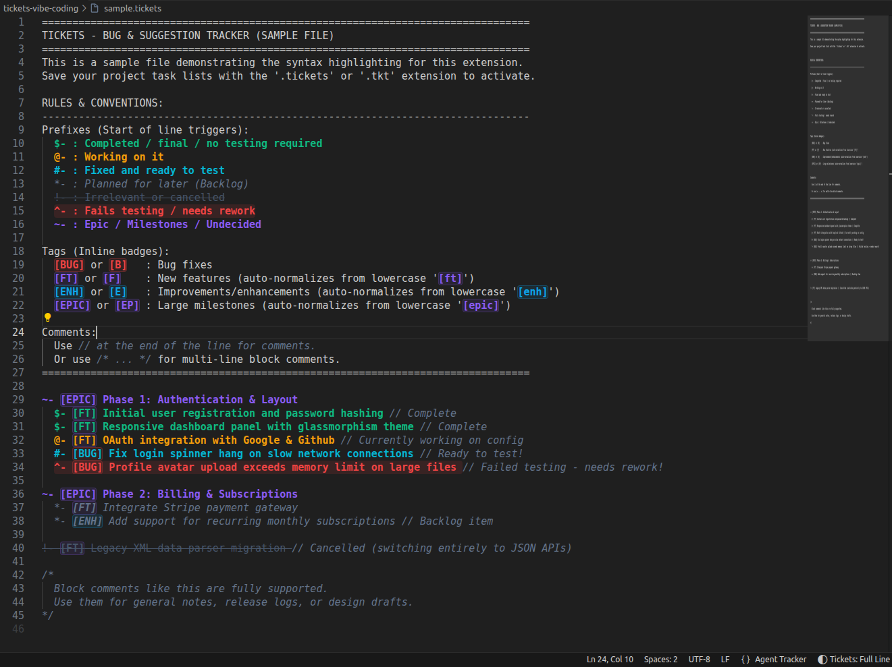

# Tickets - vibe coding issue tracker & management

A text-based ticket tracking system. A lightweight, fast, and local ticket management system designed for solo, indie, and hobbyist developers. It is built to optimize **vibe coding** and **AI-assisted development**, providing instant visual cues and structured workflows when pair-programming with AI agents (like Antigravity, Cursor, Claude Code, and others).

No complex databases, servers, or configurations required. Simply keep a `.tickets` or `.tkt` file in your workspace, and let the color-coded highlighter keep you and your AI assistant perfectly aligned.



Prefix-only highlighting keeps ticket text neutral while emphasizing its workflow state:



Full-line highlighting colors the ticket text by status while preserving each tag badge's own color:



*   **100% Offline & Local**: Files stay in your project directory.
*   **Optional Automated Ticket Numbering**: Choose whether to use ticket IDs; when enabled, the extension generates unified, padded IDs (e.g., `[HLP-0001]`).
*   **Rich Description & File Attachments**: Supports description lines with clickable paths and URLs to attach mockups, logs, screenshots, or code files.
*   **AI Agent Friendly**: Includes an updated built-in system prompt to teach any AI coder how to interact with your tickets, verify tasks, and create new tickets automatically.
*   **Epic-First Structure**: Every ticket is kept beneath an epic, with automatic spacing and configurable indentation repair.
*   **Isolated Notifications**: Hover `[*NOTIFICATION]` to review structural or AI-reported concerns. Each tracker stores its history under `.tickets/notifications/`, with its relative path preserved to prevent notices from leaking into other ticket files.
*   **Dedicated Ticket Support Folder**: New evidence, ticket-specific link files, attachments, notifications, and future tracker artifacts belong under `.tickets/` instead of cluttering the project root.
*   **Live Hover Summaries**: Hover `[INFO]` for epic totals, ticket counts by status, and detailed ticket listings grouped under each epic without adding report text to the tracker.
*   **Case Normalization**: Automatically converts lowercase tags (like `[b]`, `[ft]`, `[desc]`) to uppercase badges as you type.
*   **Fully Customizable**: Change default colors via settings or add your own custom prefix/tag rules with ease.

📬 Contact / Feedback: jihad.k.m@gmail.com

---

## 🎨 Default Rules & Syntax

This extension applies highlighting to lines starting with the following status prefixes:

*   `$-` ➔ **Completed** (Finalized / Green)
*   `@-` ➔ **In Progress** (Working on it / Orange)
*   `#-` ➔ **Fixed / Ready for Test** (Needs testing / Cyan)
*   `*-` ➔ *Planned for Later* (Backlog / Muted Gray)
*   `!-` ➔ ~~Cancelled / Irrelevant~~ (Strikethrough Gray)
*   `^-` ➔ **Failed Testing / Rework** (Needs fixes / Bold Red with Red background)
*   `~-` ➔ **Epic / Undecided** (Needs discussion / Purple)

### Inline Tags
*   `[BUG]` or `[B]` ➔ Red badge
*   `[FT]` or `[F]` ➔ Violet badge (auto-normalizes from `[ft]` or `[f]`)
*   `[ENH]` or `[E]` ➔ Blue badge (auto-normalizes from `[enh]`)
*   `[EPIC]` or `[EP]` ➔ Purple badge (auto-normalizes from `[epic]`)
*   `[DESC]` ➔ Teal badge (auto-normalizes from `[desc]` or `[description]`) for description lines.
*   `[SUB]` ➔ Pink badge for nested work. Deeper indentation or `--` expresses the parent/child relationship.
*   `[TEST]` ➔ Amber badge for a test case. Every test case must have a child `[LINK]` line.
*   `[LINK]` ➔ One or more ticket references, such as `[LINK] [HLP-0001][DOC-005]`. Each ID is green when found or red when it does not exist. The `[LINK]` badge uses the worst result on the line. An unresolved `[LINK]{nil}` placeholder is orange. You can delete `{nil}` and type a reference normally, including with VS Code Auto Save enabled; the placeholder is restored only if you leave the link empty.
*   `[HELP]` ➔ Protected marker restored at the top of every ticket file. Hover over it for a compact rules and conventions reference.
*   `[NOTIFICATION]` ➔ Gray badge when there is no active notice. `[*NOTIFICATION]` becomes orange when attention is required; hover it to see details and recent notification history.
*   `[INFO]` ➔ Protected blue information badge. Hover it for a live summary calculated from the current file.

Tag badges retain their own colours in full-line highlighting mode; the ticket status colour applies only to the rest of the line.

### Ticket Numbering
Ticket numbering is optional. It is enabled by default for backward compatibility and assigns a unique, padded ID of the format `[<PREFIX>-<NUMBER>]` (e.g., `[HLP-0001]`). Disable **`agentTicketHighlighter.enableTicketNumbering`** to use status prefixes and tags without IDs.
- **Intelligent Prefixes**: Declare a prefix in the file (e.g., `[PREFIX: HLP]`) or set `agentTicketHighlighter.projectPrefix` to override it. When neither is provided, the extension reuses an existing ticket prefix or derives one from a `[PROJECT: ...]` declaration, the tracker heading, or the project/folder name.
- **Padded Counters**: The numbering system uses a unified auto-incrementing counter with customizable padding width (default: 4 digits).
- **Auto-Generation**: When numbering and auto-generation are enabled, typing a ticket prefix or tag appends the next sequential ID. You can still run **`Tickets: Generate Missing Ticket IDs`** manually to number a document.

### Description Lines & Clickable Attachments
Use `[DESC]` at the start of a line to provide detail or attach files. 
- Descriptions are automatically styled in italics with a soft slate color.
- File paths (e.g. `docs/design.png`, `server.js`) and URLs (e.g. `https://github.com`) inside descriptions are clickable. Hold `Ctrl` (or `Cmd` on Mac) and click to open them directly in VS Code!

### Epic-First Hierarchy

Every `[BUG]`, `[FT]`, `[ENH]`, `[SUB]`, and `[TEST]` belongs to the nearest preceding `[EPIC]`. The extension repairs the document after edits and saves:

- Epics remain top-level with an empty line above them. When an epic has `[DESC]` lines, those descriptions follow it immediately and the empty line comes after the final epic description; otherwise, the empty line follows the epic title.
- Direct epic children have at least `agentTicketHighlighter.ticketIndentation` spaces (default: 4).
- Deeper indentation creates sub-tickets. A `--` marker is an equivalent, visible way to request one additional hierarchy level.
- `[DESC]` lines use `agentTicketHighlighter.descriptionIndentation` extra spaces relative to their owning epic or ticket (default: 2).
- If tickets exist before the first epic, the extension creates an `Uncategorized Work Requiring Review` epic and activates the notification marker so the grouping can be reviewed.

The extension enforces structure locally. Semantic relevance requires an AI agent or human review: an AI should activate `[*NOTIFICATION]` and record a concise entry in that tracker's associated record under `.tickets/notifications/` when a ticket appears under an unrelated epic.

Every `.tkt` or `.tickets` file has a uniquely associated notification record whose workspace-relative path is mirrored below `.tickets/notifications/`. For example, `development.tkt` uses `.tickets/notifications/development.tkt.notification`, while `planning/bugs.tickets` uses `.tickets/notifications/planning/bugs.tickets.notification`. A marker and hover read only their own record. The extension automatically adds `.tickets/notifications/` to the workspace `.gitignore` and migrates an existing adjacent v2.1.2 sidecar without deleting the legacy file.

### Dedicated Ticket Support Folder

Keep ticket trackers in their normal project locations, but place newly created ticket-support artifacts under the workspace `.tickets/` directory:

```text
.tickets/
  notifications/             # Generated local records; automatically gitignored
  evidence/<ticket-id>/       # Screenshots, recordings, logs, and test evidence
  links/<ticket-id>/          # Ticket-specific link or reference files
  attachments/<ticket-id>/    # Other files supplied specifically for a ticket
  files/<ticket-id>/          # Future ticket-support file types
```

Use the ticket ID as the folder name when numbering is enabled; otherwise use a stable, concise ticket slug. Files that are already genuine project source, documentation, or assets may remain where they belong and can be referenced from `[DESC]` or `[LINK]`; do not move ordinary project files merely because a ticket mentions them.

### Evidence-Based Completion Reviews

A `#-` ticket is implemented and ready to test, but not yet final. During later active development, an AI may notify the user when evidence suggests that such a ticket has remained stable but was never promoted to `$-`:

- Never use elapsed days, months, file age, or project inactivity as the signal. A hobby project may legitimately remain unopened for a long period.
- First activate `[*NOTIFICATION]` and record why the ticket appears stable and ready for completion in that ticket file's associated record under `.tickets/notifications/`.
- Do not complete it during that first reminder merely because it is old.
- If the reminder remains during a later active work session, the AI may re-run the relevant tests and inspect the current behavior. Only with fresh evidence of stability and no unresolved failures may it change `#-` to `$-`, record the verification, resolve the notification, and inform the user.

### Hover-Only Ticket Information

`[INFO]` keeps reporting out of the ticket file itself. Its hover shows:

- The number of epics and total non-epic tickets.
- Counts for completed, in-progress, ready-to-test, planned, cancelled, failed/rework, undecided, and unspecified tickets.
- Every epic's status, description, ticket count, and complete nested ticket list.
- Each ticket's effective status, tag, ID, title, nesting depth, and description when available.

---

## 📋 Example Ticket File (`sample.tickets`)

Save the following content as `tasks.tickets` or `tasks.tkt` to see the formatting in action:

```text
[HELP] Hover here for ticket rules and conventions.
[NOTIFICATION] No active ticket notifications.
[INFO] Hover here for the current ticket summary.
[PREFIX: HLP]
================================================================================
TICKETS - BUG & SUGGESTION TRACKER
================================================================================

~- [EPIC][HLP-0001] Phase 1: Authentication & Layout
  [DESC] *Core modules for user auth. See design mockup in docs/design.png*

    $- [FT][HLP-0002] Initial user registration and password hashing // Complete
    $- [FT][HLP-0003] Responsive dashboard panel with glassmorphism theme // Complete
    @- [FT][HLP-0004] OAuth integration with Google & Github // Working on config
    #- [BUG][HLP-0005] Fix login spinner hang on slow network connections
      [DESC] *Test on slow 3G network simulation. Refer to log details in logs/auth.log*
    ^- [BUG][HLP-0006] Profile avatar upload exceeds memory limit on large files
      [DESC] *Fails on files > 10MB. Public spec link: https://api.example.com/uploads*

~- [EPIC][HLP-0007] Phase 2: Billing & Subscriptions

    *- [FT][HLP-0008] Integrate Stripe payment gateway
    *- [ENH][HLP-0009] Add support for recurring monthly subscriptions // Backlog item
    !- [FT][HLP-0010] Legacy XML data parser migration // Cancelled (switching to JSON APIs)
```

---

## ⚙️ Custom Configurations (Settings)

Customize the extension's behavior in your global `settings.json`:

```json
{
  // Optional override; leave empty to derive it from the project
  "agentTicketHighlighter.projectPrefix": "",

  // Padding width for ticket IDs (4 results in 0001, 5 in 00001)
  "agentTicketHighlighter.idPadding": 4,

  // Set to false to use tickets without numbers
  "agentTicketHighlighter.enableTicketNumbering": true,

  // Automatically append IDs when numbering is enabled
  "agentTicketHighlighter.autoGenerateIds": true,

  // Spaces per ticket hierarchy level; removed indentation is restored
  "agentTicketHighlighter.ticketIndentation": 4,

  // Extra spaces for [DESC] relative to its owning epic or ticket
  "agentTicketHighlighter.descriptionIndentation": 2,

  // Highlight the full line instead of just the status prefix
  "agentTicketHighlighter.highlightFullLine": false,

  // Customize default status colors
  "agentTicketHighlighter.colors.completed": "#10b981",
  "agentTicketHighlighter.colors.working": "#fb923c"
}
```

---

## 🎛️ Command Palette & Status Bar

- **Initialize Starter Template**: When opening an empty `.tickets` file, you will be prompted to initialize it. You can also run **`Tickets: Initialize Template`** from the Command Palette.
- **Generate Missing IDs**: Run **`Tickets: Generate Missing Ticket IDs`** to automatically add unique IDs to any unnumbered tickets.
- **Toggle Highlighting Mode**: Click the status bar item in the bottom right corner (e.g. `Tickets: Prefix Only`) or run **`Tickets: Toggle Full Line Highlighting`** to toggle full line highlights.

---

## 🤖 System Prompt for AI Agents

Copy and paste this prompt when starting a chat with any AI assistant (like Antigravity, Claude Code, or Copilot) to ensure it handles your ticket tracking files correctly:

```text
You are working on a project that utilizes a custom ticket/bug tracking format stored in files with extension '.tickets' or '.tkt' (e.g., 'bugtracker.tickets').

Please adhere to the following rules when reading, analyzing, or modifying these files:

1. Always read every relevant '.tickets' and '.tkt' file at the start of your turn to review epics, issues, features, and logs before making changes.
2. Update the status prefixes at the start of lines to reflect your progress:
   - Use '@-' as prefix if you are currently working on an issue/feature.
   - Use '#-' as prefix when you have completed a fix/feature and it is ready for testing.
   - Use '*-' for items planned for later.
   - Use '!-' for cancelled or irrelevant items.
   - Use '$-' for items that are completed, final, and require no further testing.
   - Use '^-' if an item has failed testing and needs rework.
   - Use '~-' if an item is read but not yet decided on, or needs further epic-level planning.
3. Ticket numbering is optional. If the project uses numbering, every ticket line (starts with a status prefix) must have a unique identifier of the format '[<PREFIX>-<NUMBER>]' (e.g., '[HLP-0001]') placed right after the tag (if present) or status prefix. If numbering is disabled, do not add identifiers.
   - IDs are unique across all '.tickets' and '.tkt' files in the current VS Code workspace. Before selecting the next number, inspect matching ticket prefixes across the workspace.
   - Tags identify the ticket's role and must be preserved when its status changes: `[BUG]`/`[B]` for bugs, `[FT]`/`[F]` for features, `[ENH]`/`[E]` for enhancements, `[EPIC]`/`[EP]` for epics, `[SUB]` for nested work, `[TEST]` for test cases, `[LINK]` for ticket references, `[DESC]` for descriptions, `[NOTIFICATION]`/`[*NOTIFICATION]` for notices, and `[INFO]` for the hover-only live summary.
4. If the human user asks you to work on something, do something, or plan changes, you MUST:
   a. Check the '.tickets' file first to see if there is an existing, relevant ticket.
   b. If you find a relevant ticket, ask the user to verify if the task is related (e.g. "Is this related to ticket [HLP-0001]?"). If verified, change its status to '@-' and update it as you work.
   c. If you do NOT find a relevant ticket, or if the user confirms that the suggested tickets are not relevant, create a new ticket beneath the most relevant existing epic. If no relevant epic exists, create one first. Add the next auto-incremented ID only when the project uses numbering, and inform the user of the new ticket (including its number when applicable) before writing code.
5. Ticket descriptions can be added on subsequent lines using the '[DESC]' tag (auto-normalized from '[desc]' or '[description]'). 
   - Descriptions might contain paths to related files (e.g., UserStories, Project Documents, bug evidences, screenshots, code files, logs) or public URLs.
   - As an AI agent, you must go through and read these referenced files or URLs when necessary to solve tasks.
   - If the referenced path is broken or unavailable, you must inform the human user and ask for the correct path.
   - If you are unable to process the data, you must seek how to process and ask human to decide to continue or not or how to proceed.
6. If the tickets file is empty or contains ungrouped work, analyze the workspace and the existing ticket text. Intelligently group every issue and feature beneath a relevant epic, creating as many epics as needed. Never leave a ticket outside an epic.
7. Write every epic and ticket title as a concise, accurate, professional one-line summary. Do not copy informal first-person wording such as "I want..." into a title. Preserve the user's requirements in `[DESC]` lines with grammar corrected but without changing their meaning: an epic may retain all relevant request lines, while each child ticket should retain only the lines relevant to that ticket when useful. Do not place the entire user query only under the epic when parts clearly belong to child tickets; a child `[DESC]` may be omitted when it would add no useful context.
8. Keep every epic at indentation zero and leave at least one empty line above it. If an epic has one or more associated `[DESC]` lines, place them immediately after the epic with no intervening blank line, then leave one empty line after the final epic description. If it has no `[DESC]`, leave the empty line immediately after the epic. Indent every non-epic ticket by at least the configured ticket indentation (default 4 spaces). Indent `[DESC]` by the configured extra description indentation (default 2 spaces) relative to its owner.
9. Maintain nested task hierarchies with deeper indentation. A tab represents one configured ticket indentation level. The `--` marker is an alternative way to express one additional child level. Preserve meaningful nesting and allow multiple sibling or deeper sub-tickets.
10. Evaluate whether each ticket is semantically relevant to its epic and parent. If it appears misplaced, do not silently move it: change `[NOTIFICATION]` to `[*NOTIFICATION]`, append a concise active entry to that tracker's associated record under `.tickets/notifications/`, and tell the user. Hovering the marker must reveal concerns only from that associated record. After resolution, return the marker to `[NOTIFICATION]`; keep the local history record.
11. Review long-standing `#-` Ready to Test tickets only during active development work. Never treat elapsed calendar time, file age, or a long period of project inactivity as evidence that a ticket is stable or completed.
   a. When later project activity and current evidence suggest that a `#-` ticket is working correctly but was never marked complete, first activate `[*NOTIFICATION]`, append the reason and evidence to that tracker's associated record under `.tickets/notifications/`, and ask the user to review promotion to `$-`.
   b. Do not change the ticket to `$-` during that first reminder merely because it appears old.
   c. If the reminder is still present in a later active work session, re-run the relevant tests and inspect the current behavior. If fresh evidence shows that the implementation is stable and there are no unresolved failures or blockers, you may change it to `$-`, record the verification and resolution in the same associated sidecar, and inform the user. Otherwise, keep it at `#-` or use `^-` when testing fails.
12. Notification records are local and file-specific. Mirror the tracker path below `.tickets/notifications/`: `name.tkt` uses `.tickets/notifications/name.tkt.notification`, and `planning/name.tickets` uses `.tickets/notifications/planning/name.tickets.notification`. Never read or write another tracker's notification record for the current marker. Ensure `.tickets/notifications/` is listed in `.gitignore`, and do not commit these generated records.
13. Use `[LINK] [<PREFIX>-<NUMBER>][<PREFIX>-<NUMBER>]` to refer to one or more tickets in the same ticket file or another accessible workspace ticket file. Verify every referenced ID independently and report each unresolved reference.
14. A `[TEST]` ticket identifies a test or test case rather than development work. Every `[TEST]` must have a child `[LINK]` referencing the ticket it verifies. If no valid target is known, retain the extension-provided `[LINK]{nil}` placeholder until a valid ID is supplied.
15. Keep `[INFO]` as a compact marker only. Do not write generated status totals or epic reports into the ticket file; the extension calculates and displays those details on hover.
16. Store newly created ticket-specific evidence images, recordings, logs, link/reference files, attachments, and future support artifacts under `.tickets/evidence/<ticket-id>/`, `.tickets/links/<ticket-id>/`, `.tickets/attachments/<ticket-id>/`, or `.tickets/files/<ticket-id>/`. When numbering is disabled, use a stable ticket slug. Do not move ordinary source code, project documentation, or assets solely because a ticket references them.
17. Keep the 'README.md' and the '.tickets' files updated as features are built.
```

---

## 📄 License
This extension is licensed under the [MIT License](LICENSE).
